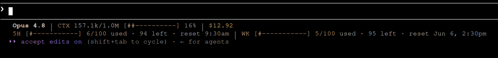

<h1 align="center">Claude Code Usage Statusline</h1>

<p align="center">
  <strong>A clean two-line Claude Code statusline for context, quota, reset time, and cost visibility.</strong>
</p>

<p align="center">
  
  
  
  
</p>

---

## Preview

<p align="center">
  
</p>

---

## What is this?

**Claude Code Usage Statusline** is a small Python-powered statusline for Claude Code.

It keeps the important usage data visible while you work:

* current model
* current context usage
* 5-hour quota usage
* weekly quota usage
* reset times
* estimated session cost

No dashboard switching.
No `/usage` checking every few minutes.
No extra dependencies like `jq`.

---

## Why?

Claude Code already has `/usage`, but many developers want an always-visible, readable statusline that answers:

```text
How much context am I using?
How much of my 5-hour quota is left?
How much weekly quota is left?
When does it reset?
How much has this session cost?
```

This project makes that information visible directly inside Claude Code.

---

## Features

* Two-line terminal HUD
* Clean Graphite / Warm Amber theme
* Context window monitor
* 5-hour usage monitor
* Weekly usage monitor
* Reset time display
* Estimated cost display
* No `jq` required
* Python 3 only
* No telemetry
* No external service
* Safe installer with backup
* Simple uninstall path
* Supports `NO_COLOR`
* Supports custom bar width

---

## Requirements

* Claude Code
* Python 3
* Bash-compatible shell

That is it.

---

## Installation

Clone the repository:

```bash
git clone https://github.com/Naveenkumar-026/claude-code-usage-statusline.git
cd claude-code-usage-statusline
```

Run the installer:

```bash
./install.sh
```

Restart Claude Code:

```bash
pkill -f claude 2>/dev/null || true
claude
```

---

## What the installer does

The installer:

1. copies the statusline script into `~/.claude/`
2. creates `~/.claude/statusline.sh`
3. safely updates `~/.claude/settings.json`
4. backs up your previous settings
5. enables Claude Code's native `statusLine` command

Your existing settings are backed up here:

```text
~/.claude/statusline-backups/
```

---

## Expected Claude Code settings

After installation, your `~/.claude/settings.json` should include:

```json
{
  "statusLine": {
    "type": "command",
    "command": "~/.claude/statusline.sh",
    "padding": 1,
    "refreshInterval": 2
  }
}
```

---

## Test locally

You can test the renderer without Claude Code:

```bash
python3 claude-statusline.py < examples/sample-statusline.json
```

Expected output:

```text
Opus 4.8 │ CTX 157.1k/1.0M [##----------] 16% │ $12.92
5H [#-----------] 6/100 used · 94 left · reset ... │ WK [#-----------] 5/100 used · 95 left · reset ...
```

---

## Disable colors

Use `NO_COLOR=1`:

```bash
NO_COLOR=1 python3 claude-statusline.py < examples/sample-statusline.json
```

Or launch Claude Code with:

```bash
NO_COLOR=1 claude
```

---

## Change bar width

Default bar width is `12`.

Example:

```bash
CLCS_BAR_WIDTH=16 claude
```

Local test:

```bash
CLCS_BAR_WIDTH=16 python3 claude-statusline.py < examples/sample-statusline.json
```

---

## How it works

Claude Code sends statusline data as JSON through `stdin`.

This script reads that JSON and renders a compact two-line statusline using fields such as:

```text
model.display_name
context_window.total_input_tokens
context_window.total_output_tokens
context_window.context_window_size
context_window.used_percentage
rate_limits.five_hour.used_percentage
rate_limits.five_hour.resets_at
rate_limits.seven_day.used_percentage
rate_limits.seven_day.resets_at
cost.total_cost_usd
```

It does not call any external API.
It does not collect data.
It only formats the local Claude Code statusline payload.

---

## Troubleshooting

### Statusline does not appear

Check your Claude Code settings:

```bash
cat ~/.claude/settings.json
```

Confirm that `statusLine` points to:

```text
~/.claude/statusline.sh
```

Then restart Claude Code:

```bash
pkill -f claude 2>/dev/null || true
claude
```

---

### Values are zero or missing

Send at least one prompt inside Claude Code.

Some fields may be empty before the first completed Claude response.

You can inspect the last payload received from Claude Code:

```bash
python3 -m json.tool /tmp/claude-statusline-last.json | head -80
```

---

### Colors look too strong

Use monochrome mode:

```bash
NO_COLOR=1 claude
```

---

### Python is missing

Install Python 3.

Arch Linux:

```bash
sudo pacman -S --needed python
```

Ubuntu/Debian:

```bash
sudo apt update
sudo apt install python3
```

macOS with Homebrew:

```bash
brew install python
```

---

## Uninstall

Run:

```bash
./uninstall.sh
```

The uninstaller removes the `statusLine` entry from Claude Code settings.

For safety, it does not automatically delete files from `~/.claude`.

To remove installed files manually:

```bash
rm -f ~/.claude/statusline.sh
rm -f ~/.claude/claude-code-usage-statusline.py
```

---

## Design Philosophy

This project is built around three rules:

```text
Readable first.
Minimal dependencies.
Useful during real coding sessions.
```

It is intentionally not a heavy dashboard, daemon, or analytics tool.

It is a simple Claude Code terminal HUD.

---

## Roadmap

Possible future additions:

* extra themes
* compact one-line mode
* config file support
* installable package release
* automatic theme preview
* terminal width detection
* optional daily usage summary

---

## Contributing

Issues, improvements, and theme ideas are welcome.

Good first contributions:

* new color themes
* better terminal compatibility
* cleaner install logic
* improved examples
* documentation fixes

---

## License

MIT License.
